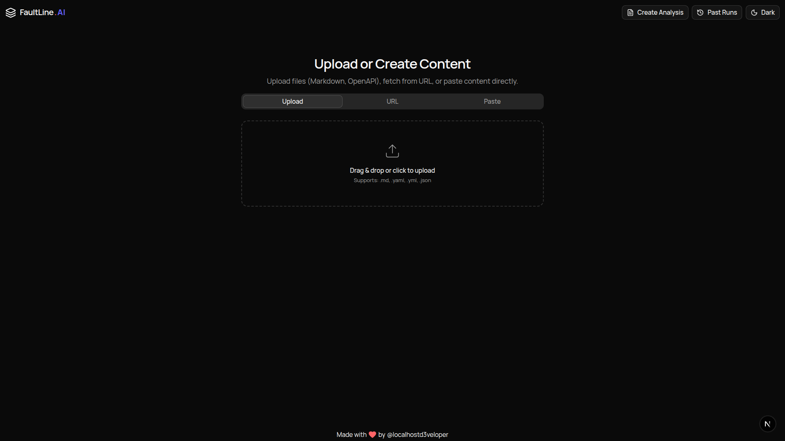
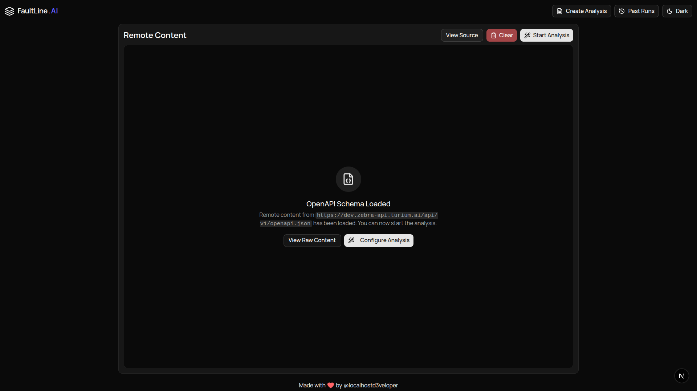
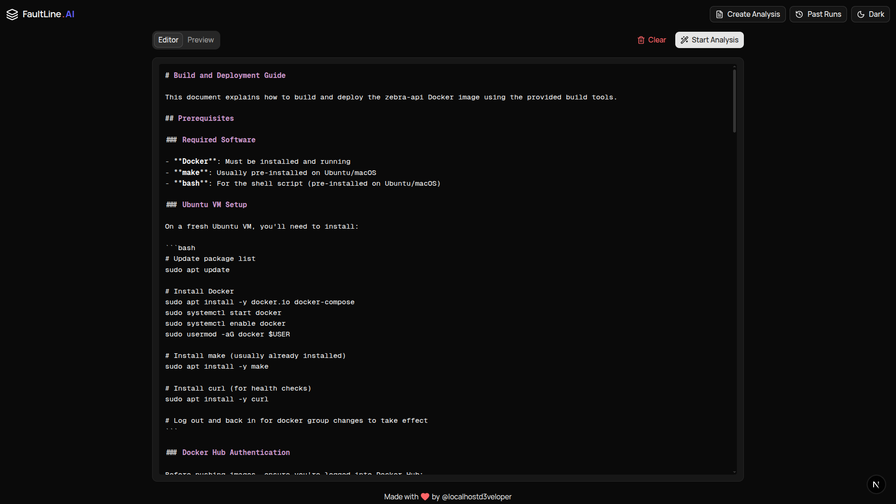
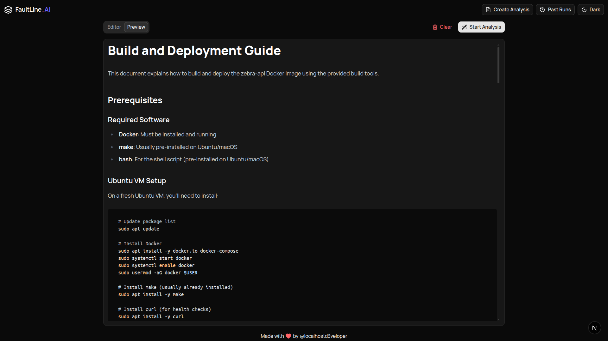
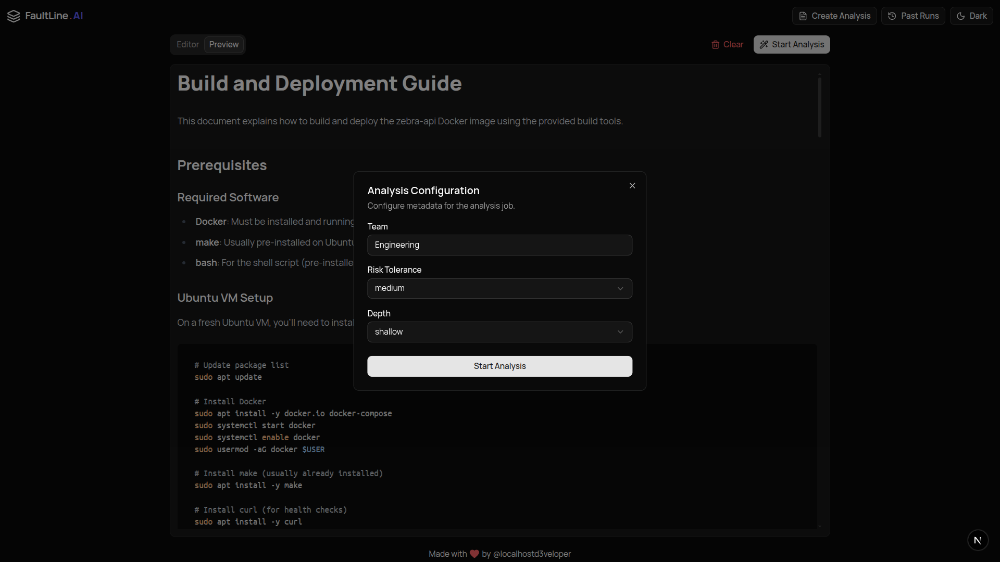
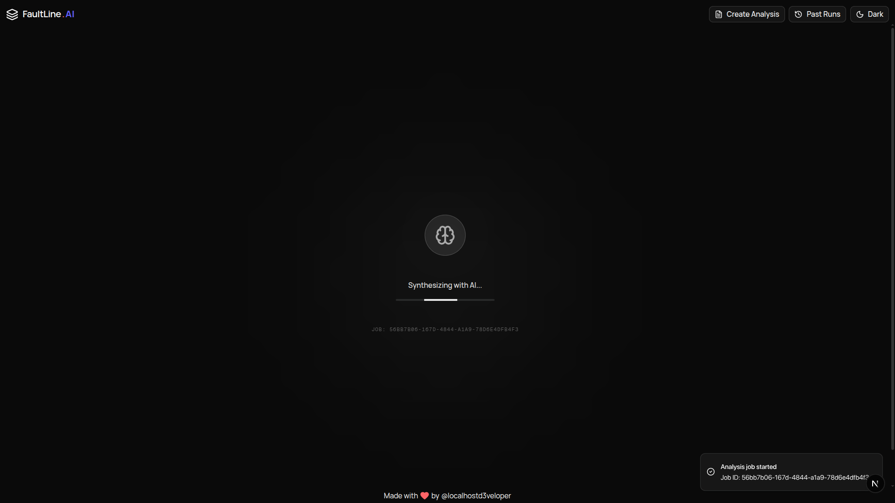
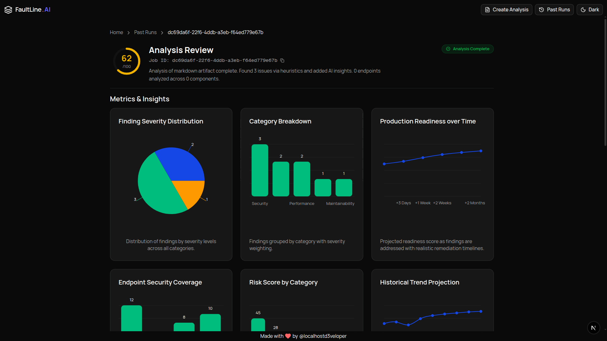
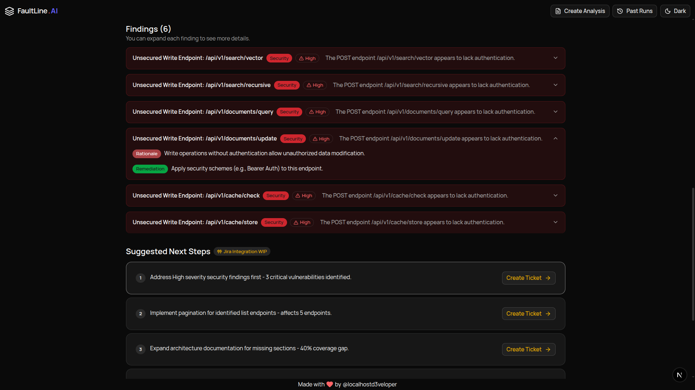

# Faultline.ai

Production-readiness analysis platform that analyzes engineering artifacts (OpenAPI specs, architecture diagrams, documentation) to identify potential issues before deployment. Uses a hybrid approach combining rule-based heuristics with AI-powered synthesis to generate comprehensive analysis reports.

## Features

- 🔍 **Multi-Format Analysis** - Supports OpenAPI (JSON/YAML), architecture diagrams, and Markdown documentation
- 🤖 **AI-Powered Insights** - Synthesizes heuristic findings with contextual analysis using multiple LLM providers
- ⚡ **Fast Results** - Content hash-based caching for instant results on duplicate analyses
- 📊 **Comprehensive Reports** - Production readiness scores, prioritized findings, charts, and actionable remediation steps
- 🎯 **Confidence-Based Analysis** - Distinguishes between high/medium/low confidence findings for accurate risk assessment
- 🔒 **Structured Output** - Guaranteed schema compliance through Pydantic AI validation

## Quick Start

### Prerequisites

- Docker and Docker Compose
- Python 3.12+ (for local development)
- Bun (for frontend development)

### Running Locally

```bash
# Clone the repository
git clone https://github.com/your-org/faultline.ai.git
cd faultline.ai

# Start all services
docker-compose up

# Access the application
# Frontend: http://localhost:3000
# Backend API: http://localhost:8080
# API Docs: http://localhost:8080/docs
```

### Development Setup

**Backend:**

```bash
cd server
uv sync
uv run fastapi dev app/main.py
```

**Frontend:**

```bash
cd client
bun install
bun dev
```

## Architecture

Faultline.ai consists of three main components:

- **Frontend** - Next.js 16 (React 19, TypeScript) with App Router
- **Backend** - FastAPI (Python 3.12) with async processing
- **AI System** - Pydantic AI with support for OpenAI, Google, Groq, and Ollama
- **Cache/State** - Redis for job state management and result caching

See [Architecture Documentation](docs/ARCH.md) for detailed system architecture.

## Documentation

Comprehensive documentation is available in the `/docs` directory:

### Core Documentation

- **[Architecture (ARCH.md)](docs/ARCH.md)** - System architecture, component overview, data flow, and deployment architecture
- **[Frontend (FRONTEND.md)](docs/FRONTEND.md)** - Frontend technology stack, routing, state management, UI components, and build process
- **[Backend (BACKEND.md)](docs/BACKEND.md)** - Backend API routes, business logic, data models, Redis integration, and AI integration
- **[AI System (AI.md)](docs/AI.md)** - AI provider support, model configuration, system prompts, input/output structures, and cost considerations

### Infrastructure Documentation

- **[Redis (REDIS.md)](docs/REDIS.md)** - Redis connection management, key patterns, data flow, operations, TTL management, and performance considerations
- **[Deployment (DEPLOYMENT.md)](docs/DEPLOYMENT.md)** - High request volume handling, AWS deployment strategy, CI/CD pipeline, and environment separation

## Technology Stack

### Frontend

- **Framework:** Next.js 16.0.10 (App Router)
- **Runtime:** React 19.2.1
- **Language:** TypeScript 5
- **Styling:** Tailwind CSS 4
- **State Management:** Zustand
- **UI Components:** Radix UI
- **Charts:** Recharts
- **Package Manager:** Bun

### Backend

- **Framework:** FastAPI 0.112.1+
- **Language:** Python 3.12+
- **AI Integration:** Pydantic AI 1.35.0+
- **Cache/State:** Redis 7.1.0+
- **Logging:** Loguru
- **Package Manager:** UV

### AI Providers Supported

- OpenAI (GPT models)
- Google (Gemini)
- Groq
- Ollama (local models)

## Project Structure

```
faultline.ai/
├── client/                 # Next.js frontend
│   ├── app/               # App Router pages and routes
│   ├── components/        # UI components
│   └── lib/               # Utilities, API client, hooks
├── server/                # FastAPI backend
│   ├── app/
│   │   ├── routers/      # API route handlers
│   │   ├── logic/        # Business logic
│   │   ├── schemas/      # Pydantic models
│   │   └── main.py       # FastAPI app entry point
│   └── Dockerfile
├── docs/                  # Documentation
│   ├── ARCH.md
│   ├── FRONTEND.md
│   ├── BACKEND.md
│   ├── AI.md
│   ├── REDIS.md
│   └── DEPLOYMENT.md
└── docker-compose.yaml    # Local development setup
```

## API Endpoints

### Analysis

- `POST /artifacts/analyze` - Submit artifact for analysis
- `GET /jobs/{job_id}` - Get job status
- `GET /jobs/{job_id}/result` - Get analysis result
- `GET /jobs` - List all jobs

### System

- `GET /health` - Health check
- `GET /` - API root

See [Backend Documentation](docs/BACKEND.md) for detailed API documentation.

## Configuration

### Environment Variables

**Backend:**

- `REDIS_URL` - Redis connection string
- `AI_PROVIDER` - openai|google|groq|ollama
- `AI_MODEL` - Model identifier
- `OPENAI_API_KEY` - OpenAI API key
- `GEMINI_API_KEY` - Google API key
- `GROQ_API_KEY` - Groq API key
- `OLLAMA_BASE_URL` - Ollama server URL
- `DEMO_MODE` - Enable demo mode (bypasses AI)
- `MAX_CONTENT_SIZE` - Max artifact size (default: 500KB)
- `LOG_LEVEL` - Logging level

**Frontend:**

- `BACKEND_API_URL` - Backend API URL
- `NODE_ENV` - Environment mode

See [Backend Documentation](docs/BACKEND.md#configuration) for complete configuration options.

## How It Works

1. **User submits artifact** (OpenAPI, architecture diagram, or documentation)
2. **Content is normalized** into structured data (endpoints, components, sections)
3. **Heuristics run** to identify rule-based findings with confidence levels
4. **AI synthesizes** findings into prioritized analysis with contextual insights
5. **Results are cached** by content hash for instant retrieval on duplicates
6. **Report generated** with production readiness score, findings, charts, and next steps

## Why AI is Used

Production-readiness analysis requires more than simple pattern matching. While rule-based heuristics can identify specific issues, they cannot:

1. **Prioritize findings by real-world impact** - A missing authentication on a read-only endpoint is less critical than on a write endpoint
2. **Synthesize contextual insights** - Multiple low-severity findings in the same area may indicate a systemic problem
3. **Generate actionable remediation** - Context-aware remediation strategies that consider specific architecture and constraints
4. **Create executive summaries** - Clear, concise explanations of what will break first and why
5. **Calculate production readiness scores** - Understanding relative importance of issues, their interactions, and overall system health
6. **Identify implicit risks** - Risks implied by the combination of findings rather than explicitly stated

### The Hybrid Approach

Faultline.ai uses a **two-stage hybrid approach**:

1. **Heuristics (Rule-Based)** - Fast, deterministic, high-confidence findings with confidence levels
2. **AI Synthesis** - Contextual analysis, prioritization, and insight generation

This combines the **reliability of rules** with the **intelligence of AI**, resulting in accurate and insightful analysis.

## How Hallucinations are Minimized

Faultline.ai employs multiple layers of safety to minimize AI hallucinations:

1. **Structured Input Grounding** - AI operates on normalized, structured data (not raw text) with pre-validated heuristic findings
2. **Strict Interpretation Rules** - High-confidence findings treated as factual; low-confidence as weak signals
3. **Confidence-Based Weighting** - Distinguishes between high/medium/low confidence to prevent overemphasizing uncertain findings
4. **Explicit Prohibition of Invention** - AI cannot invent technologies, services, or failures not present in the artifact
5. **Two-Stage Validation** - Heuristics validate input before AI processing
6. **Low Temperature Setting** - `temperature=0.2` reduces creativity and increases consistency
7. **Structured Output Validation** - Pydantic AI enforces schema compliance with automatic retries

## How Output Structure is Enforced

The system guarantees structured output through multiple mechanisms:

1. **Pydantic AI Framework** - Enforces structured output at the framework level with automatic schema validation
2. **Pydantic Schema Definition** - Exact structure defined with type enforcement (e.g., `production_readiness_score` must be int)
3. **Nested Model Validation** - Even nested structures (findings, charts) are validated
4. **Strict System Prompt** - Explicit output format requirements in the AI prompt
5. **Retry Logic** - Up to 3 agent retries + 3 output retries for schema compliance
6. **Runtime Type Validation** - Additional checks after Pydantic AI validation
7. **Explicit Field Requirements** - Prompt specifies exact requirements (e.g., "exactly three charts")

This multi-layered approach ensures reliable, actionable analysis reports with guaranteed schema compliance.

## Development

### Running Tests

```bash
# Backend tests
cd server
uv run pytest

# Frontend tests
cd client
bun test
```

### Code Quality

```bash
# Backend linting
cd server
uv run isort .
uv run ruff check .

# Frontend linting
cd client
bun run lint
```

## Deployment

Faultline.ai is designed for containerized deployment on AWS:

- **Frontend:** S3 + CloudFront (static) or ECS Fargate
- **Backend:** ECS Fargate with auto-scaling
- **Redis:** ElastiCache
- **Load Balancing:** Application Load Balancer

See [Deployment Documentation](docs/DEPLOYMENT.md) for complete deployment strategy, CI/CD pipeline, and environment separation.

## Contributing

1. Fork the repository
2. Create a feature branch (`git checkout -b feature/amazing-feature`)
3. Commit your changes (`git commit -m 'Add some amazing feature'`)
4. Push to the branch (`git push origin feature/amazing-feature`)
5. Open a Pull Request

## FAQ

### Why use AI instead of pure rule-based analysis?

Rule-based heuristics can identify specific issues but cannot prioritize findings by real-world impact, synthesize contextual insights, generate actionable remediation, or create executive summaries. The hybrid approach combines the reliability of rules with the intelligence of AI.

### How do you prevent AI hallucinations?

Multiple safeguards are in place:

- AI operates only on structured, validated data (normalized artifacts + heuristic findings)
- Strict interpretation rules treat high-confidence findings as factual
- Explicit prohibition against inventing technologies or services
- Low temperature setting (0.2) reduces creativity
- Pydantic AI enforces schema compliance with automatic retries

### What happens if the AI output doesn't match the expected schema?

The system automatically retries up to 3 times for agent calls and 3 additional times for schema validation (total: up to 9 attempts). Invalid outputs are rejected and the model is retried until a valid schema-compliant response is generated.

### How does caching work?

Content is hashed using SHA256. If the same content is analyzed again within 24 hours, the cached result is returned instantly without AI processing, significantly reducing costs and improving response time.

### Can I use my own AI model?

Yes! Faultline.ai supports multiple providers:

- OpenAI (GPT models)
- Google (Gemini)
- Groq
- Ollama (local models)

Configure via the `AI_PROVIDER` environment variable.

### What's the difference between heuristic findings and AI findings?

- **Heuristic findings** are rule-based, deterministic, and have confidence levels (high/medium/low)
- **AI findings** synthesize heuristic findings, add contextual insights, and prioritize by production risk

High-confidence heuristic findings are treated as factual by the AI.

### How accurate is the production readiness score?

The score (0-100) is calculated by the AI based on:

- Severity and quantity of findings
- Category distribution (security, reliability, etc.)
- Real-world production risk assessment

It's a relative indicator meant to help prioritize remediation efforts, not an absolute measure.

### Can I analyze private/internal APIs?

Yes. The system processes artifacts locally. For maximum privacy, use Ollama with local models - no data leaves your infrastructure.

### What file formats are supported?

- OpenAPI/Swagger: JSON and YAML
- Architecture diagrams: Markdown text descriptions
- Documentation: Markdown files

### How long does analysis take?

- **Cached results:** Instant (< 1 second)
- **New analysis:** 5-30 seconds depending on:
  - Artifact size
  - AI provider (Groq is fastest, Ollama slowest)
  - Model complexity

### Is there a rate limit?

Currently no rate limiting in the open-source version. For production deployments, see [Deployment Documentation](docs/DEPLOYMENT.md) for recommended rate limiting strategies.

### How do I contribute?

1. Fork the repository
2. Create a feature branch
3. Make your changes
4. Submit a pull request

See the [Contributing](#contributing) section above.

## License

See [LICENSE](LICENSE) file for details.

## Screenshots

### Home Page - Content Upload



### URL Loaded - OpenAPI Fetch



### Markdown Editor



### Markdown Preview



### Analysis Dialog



### Loading - Job Status Polling



### Analysis Results



### Findings and Actions


